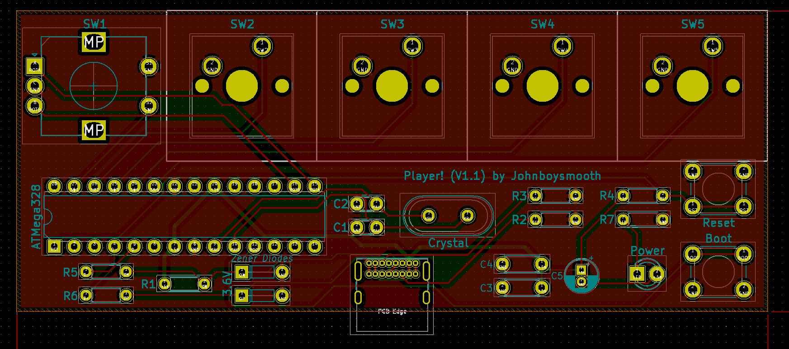

# Player! V1.1

Player! is a five key macropad designed for pausing/playing music, changing music volume, switching to previous and next songs in Spotify without tabbing into the Spotify window; made possible by Toastify. Player! also includes a dedicated key to deafen the user in Discord.

Player! is licensed under the [Creative Commons Attribution-NonCommercial 4.0 International License] This work is licensed under a <a rel="license" href="http://creativecommons.org/licenses/by-nc/4.0/">Creative Commons Attribution-NonCommercial 4.0 International License</a>.

 Player! is licensed under a <a rel="license" href="http://creativecommons.org/licenses/by-nc/4.0/">Creative Commons Attribution-NonCommercial 4.0 International License </a>

